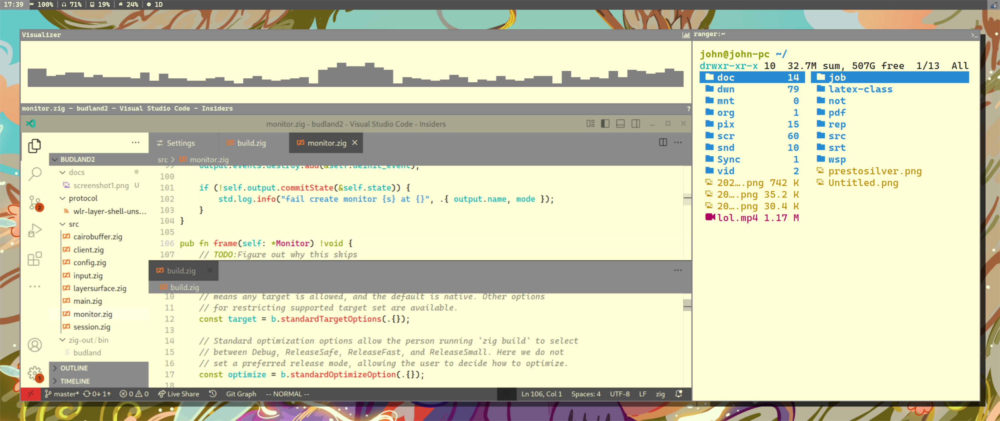
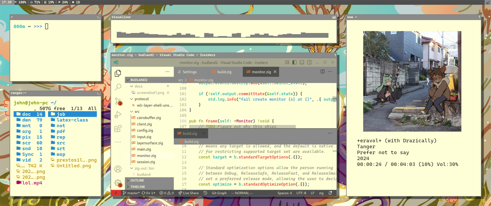
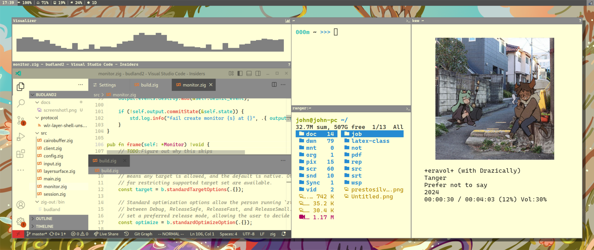

# Con-positor

## Install

To install this just clone the repo and install it using zig build, the dependencies will be fetched with the repo.
**NOTE: This currently requires zig 0.15+**

## About

Conpositor is a wayland compositor that uses a container system simmilar to tiling. I made this because I got sick of manually moving all my windows.

## Config

More documentation to come later, for now see [the sample config.](docs/init.lua)

## Screenshots

We have window frames for every environment you can think of!

### Sparse

### Busy

### Busy and Dense

